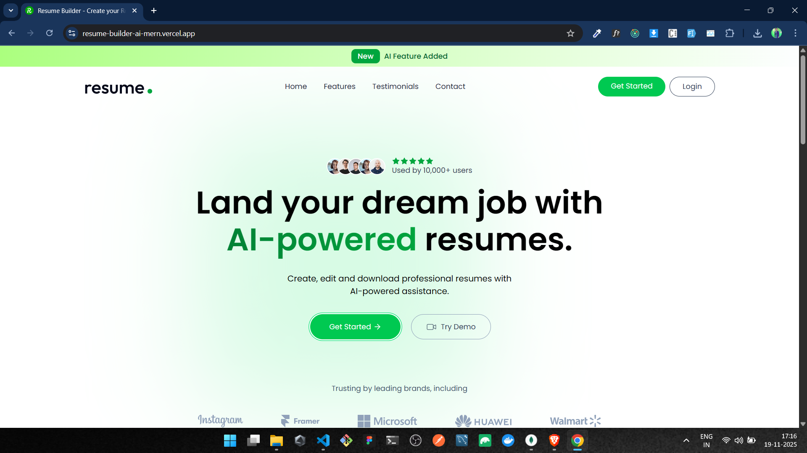

# 🚀 AI-Powered Resume Generator using MERN + Gemini Flash 2.5 + Tailwind UI

<p align="center">
  
  
  
  
</p>

## 📘 Contents

- ⭐ [About the Project](#about-the-project)
- ✨ [Features](#features)
- 🧰 [Tech Stack](#tech-stack)
- 🧱 [Architecture](#architecture)
- 🖼️ [Screenshots](#screenshots)
- 🌐 [Live Demo](#live-demo)
- 🔧 [Installation](#installation)
- 🔑 [Environment Variables](#environment-variables)
- ▶ [Run Locally](#run-locally)
- 📡 [API Endpoints](#api-endpoints)
- 📂 [Folder Structure](#folder-structure)
- 🧪 [Future Enhancements](#future-enhancements)
- 🤝 [Contributing](#contributing)
- 📄 [License](#license)
- 📬 [Contact](#contact)

---

## ⭐ About the Project

**Resume-Builder MERN** is a modern web application designed to help users build professional resumes with ease.
It integrates **Gemini Flash 2.5 AI** for generating content like:

- Resume Summary
- Skills
- Work Experience Bullets
- Project Descriptions

The app is built using **React + Tailwind** with a clean UI and supports **AI, CRUD features, live preview, and PDF export**.

---

## ✨ Features

### 🎨 **Frontend**

- Beautiful UI using **React + TailwindCSS**
- Prebuilt modern UI components
- Multiple Resume Templates
- Live Resume Preview
- Fully Responsive

### 🤖 **AI Integration**

- Gemini Flash 2.5 API
- Auto-generate Resume Summary
- AI-generated Skills & Experience
- Smart Suggestions Section

### 🟩 **Backend + Database**

- Node.js + Express server
- MongoDB for storing user & resume info
- Secure endpoints
- CRUD operations

### 📤 **Extra Functionalities**

- Export PDF
- Edit & Update Resume
- Save & Manage Multiple Resumes

---

## 🧰 Tech Stack

| Layer        | Technologies                    |
| ------------ | ------------------------------- |
| **Frontend** | React, TailwindCSS, Prebuilt UI |
| **Backend**  | Node.js, Express.js             |
| **Database** | MongoDB                         |
| **AI**       | Gemini Flash 2.5 API            |
| **Tools**    | Git, GitHub                     |

---

## 🧱 Architecture

```
Frontend (React + Tailwind)
        ⬇️ REST API
Backend (Node + Express)
        ⬇️
Database (MongoDB)
        ⬇️
AI Layer (Gemini Flash 2.5)
```

---

## 🖼️ Screenshots

| Home Page                       | AI Generator                                  | Resume Preview                             |
| ------------------------------- | --------------------------------------------- | ------------------------------------------ |
|  |  |  |

---

## 🌐 Live Demo

<!-- Frontend Live -->
  <a href="https://resume-builder-ai-mern.vercel.app/" target="_blank">
    
  </a>

  <!-- Backend Live -->
  <a href="https://resume-builder-ai-backend.onrender.com" target="_blank">
    
  </a>

---

## 🔧 Installation

Clone the repo

```bash
git clone https://github.com/ChinmayKaitade/Resume-Builder-MERN
cd Resume-Builder-MERN
```

Install dependencies

```bash
cd client && npm install
cd ../server && npm install
```

---

## 🔑 Environment Variables

Create `.env` inside **server** folder:

```
MONGO_URI=your_mongodb_connection_string
PORT= 4000
GEMINI_API_KEY=your_api_key_here
```

---

## ▶ Run Locally

Start Backend

```bash
cd server
npm run dev
```

Start Frontend

```bash
cd ../client
npm start
```

Open app at:
👉 **[http://localhost:5173](http://localhost:5173/)**

---

## 📡 API Endpoints

### 👤 **User Routes** (`/api/users`)

| Method   | Endpoint    | Description                       | Auth   |
| -------- | ----------- | --------------------------------- | ------ |
| **POST** | `/register` | Register a new user               | ❌     |
| **POST** | `/login`    | Login user & get JWT token        | ❌     |
| **GET**  | `/data`     | Get logged-in user details        | ✔️ JWT |
| **GET**  | `/resumes`  | Get all resumes created by a user | ✔️ JWT |

---

### 📄 **Resume Routes** (`/api/resumes`)

| Method     | Endpoint            | Description                                        | Auth   |
| ---------- | ------------------- | -------------------------------------------------- | ------ |
| **POST**   | `/create`           | Create a new resume                                | ✔️ JWT |
| **PUT**    | `/update`           | Update a resume (Supports image upload via Multer) | ✔️ JWT |
| **DELETE** | `/delete/:resumeId` | Delete resume by ID                                | ✔️ JWT |
| **GET**    | `/get/:resumeId`    | Get resume by ID (Private)                         | ✔️ JWT |
| **GET**    | `/public/:resumeId` | Get public resume (Public View)                    | ❌     |

---

### 🤖 **AI Routes (Gemini Flash 2.5 Integrated)** (`/api/ai`)

| Method   | Endpoint            | Description                           | Auth   |
| -------- | ------------------- | ------------------------------------- | ------ |
| **POST** | `/enhance-pro-sum`  | Enhance professional summary using AI | ✔️ JWT |
| **POST** | `/enhance-job-desc` | Improve job description using AI      | ✔️ JWT |
| **POST** | `/upload-resume`    | Upload resume & generate AI insights  | ✔️ JWT |

---

## 📂 Folder Structure

```
Resume-Builder-MERN/
│
├── client/        # React App
│   ├── src/
│   ├── public/
│
├── server/        # Node + Express Backend
│   ├── controllers/
│   ├── routes/
│   ├── models/
│   ├── middleware/
│
└── README.md
```

---

## 🧪 Future Enhancements

🔹 More resume templates
🔹 Drag & Drop resume builder
🔹 User authentication + cloud storage
🔹 Resume version history
🔹 Export in Word format
🔹 Theme customization

---

## 🤝 Contributing

Contributions are **highly appreciated** 💙

- Fork the repo
- Create a new branch
- Commit your changes
- Submit a PR

---

## 📄 License

This project is licensed under the [MIT License](./LICENSE).

---

## 📬 Contact

**👤 Chinmay Kaitade**

<p align="center">
  <a href="https://www.linkedin.com/in/chinmay-sharad-kaitade" target="_blank">
    
  </a>
  <a href="mailto:chinmaykaitade123@gmail.com" target="_blank">
    
  </a>
  <a href="https://twitter.com/chinmaydotcom" target="_blank">
    
  </a>
  <a href="https://github.com/ChinmayKaitade" target="_blank">
    
  </a>
  <a href="https://chinmaykaitadeportfolio.vercel.app/" target="_blank">
    
  </a>
  <a href="https://www.youtube.com/@chinmaykaitade" target="_blank">
    
  </a>
</p>

> Made with ❤️ by Chinmay Kaitade
