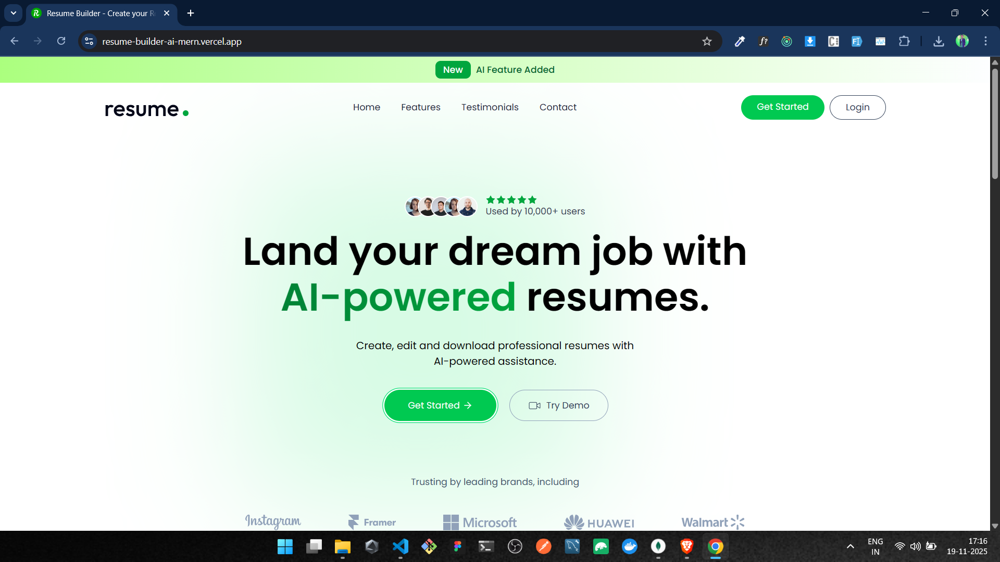

# ResumeForge AI 🚀

A modern, full-stack, AI-powered Resume Builder that dynamically matches your profile against Applicant Tracking Systems (ATS) and specific job descriptions using the **Google Gemini** language model.

## Screenshots

  

  
  

## Features

- **Smart ATS Analyzer**: Evaluates resumes in real-time, providing a 0-100 match score with tailored strengths and missing keyword suggestions.
- **Job Description Matcher**: Compare your resume securely against pasted LinkedIn/Indeed job postings to discover exactly which required skills are missing.
- **AI Content Generator**: Automatically generates and enhances your Professional Summary and Experience bullets using professional action verbs.
- **Minimalist & Dynamic UI**: Responsive split-panel editor built entirely with React and Tailwind CSS.
- **Secure Cloud Storage**: Connects to ImageKit for rapid profile photo hosting.
- **MongoDB + JWT Auth**: Complete registration and login system with bcrypt password hashing handling deeply nested JSON document structures.

## Tech Stack

- **Frontend**: React (Vite), Tailwind CSS, Redux Toolkit, Lucide React icons
- **Backend**: Node.js, Express.js, MongoDB (Mongoose), JSON Web Tokens (JWT)
- **AI Integration**: Google Gemini (`@google/genai`)
- **Cloud Storage**: ImageKit

## Running Locally

### Prerequisites
- Node.js (v18+ recommended)
- A MongoDB cluster (Atlas or local)
- A Google Gemini API Key
- ImageKit public/private keys

### 1. Backend Setup
1. Open the `server` directory in your terminal.
2. Rename `.env-example` to `.env` and fill in your keys.
3. Install dependencies: `npm install`
4. Start the development server: `npm run server` (runs on `http://localhost:4000` via nodemon).

### 2. Frontend Setup
1. Open the `client` directory in your terminal.
2. Ensure your `VITE_BASE_URL` in `client/.env` points to your backend.
3. Install dependencies: `npm install`
4. Start the frontend server: `npm run dev`

